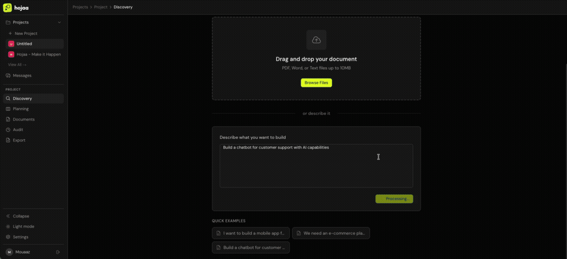

<div align="center">

  

  <h1>hojaa</h1>

  <p><em>Make it happen.</em></p>

  <p>AI-powered requirements discovery & scope management for teams that ship fast.<br/>From vague idea to structured scope tree in minutes — not weeks.</p>

  <p>
    <a href="LICENSE"></a>
    
    
    
    
    
  </p>

  <p>
    <a href="#-quick-start">Quick Start</a> &bull;
    <a href="#-the-problem">The Problem</a> &bull;
    <a href="#-features">Features</a> &bull;
    <a href="#-how-it-works">How It Works</a> &bull;
    <a href="#-self-hosted">Self-Hosted</a> &bull;
    <a href="docs/">Docs</a>
  </p>

  <br/>

  <a href="https://hojaa.com">
    
  </a>

  <sub>🎬 <a href="https://hojaa.com">Watch the full demo at hojaa.com</a></sub>

</div>

---

## 😤 The Problem

Every software project starts the same way: vague requirements, scattered across emails, Slack threads, and meeting notes. Teams jump straight into Jira tickets without truly understanding what they're building.

**The result?** 💸 Scope creep. ❌ Missed requirements. 🔄 Rework. 🗑️ Wasted sprints.

Hojaa fixes this by putting **discovery before execution**. Upload a document, answer AI-generated questions, and watch a structured requirement tree emerge — with every decision tracked, attributed, and auditable.

---

## 🚀 Quick Start

```bash
git clone https://github.com/YOUR_ORG/hojaa.git && cd hojaa
cp .env.example .env          # Add your OpenAI or Anthropic API key
make up                        # Starts PostgreSQL + API + Web UI
```

Open **http://localhost:3000** — that's it. Three commands to a running instance.

---

## ✨ Features

### 🧠 AI-Powered Discovery

Upload PDF, DOCX, or TXT documents. Hojaa reads them and generates **10 targeted questions** — technical and non-technical variants — tailored to your specific project context. No generic templates.

### 🌳 Interactive Scope Tree

Requirements live in a visual tree powered by React Flow. Click **[+]** on any node to start a contextual AI conversation that digs deeper into that specific feature. Confirmed insights become child nodes. The tree grows as understanding deepens.

### 📥 Multi-Source Ingestion

Meeting notes changed the scope? A Slack thread added a new requirement? Feed it in. Hojaa detects what changed, suggests tree modifications, and **attributes every change to its source**. Nothing gets lost.

### 🕰️ Full Audit Trail & Time Travel

Every change is recorded — who changed what, when, and why. Use **time-travel view** to see your scope tree at any historical point. Perfect for regulated industries, client disputes, or just understanding how scope evolved.

### 📝 Document Builder

Create proposals, SOWs, and contracts with an AI-powered block editor. Insert **project variables** that auto-fill from your scope data, add pricing tables, and generate content with the built-in AI assistant. Share with clients via secure links.

### 📋 Planning Board

Kanban board (Backlog → TODO → In Progress → Review → Done) that maps requirements directly to work items. **AI-generated acceptance criteria** for each card. Assign team members. Track progress.

### 💬 Team Messaging

Built-in real-time messaging — DMs and group channels with project references. No need to context-switch to Slack for project discussions. WebSocket-powered with auto-reconnect.

### 📤 Export & Integrations

Export to **PDF**, **JSON**, or **Markdown**. Push cards to **Jira**. Send notifications to **Slack**. White-label the interface with your own branding, colors, and logo.

---

## 🔄 How It Works

| | Step | What Happens |
|:---:|:---|:---|
| 📄 | **Upload** | Upload a document or describe your project in plain text |
| 🤔 | **Discover** | AI generates 10 targeted questions based on your context |
| 🌳 | **Build** | AI constructs a hierarchical requirement tree from your answers |
| 🔍 | **Explore** | Click [+] on any node — contextual AI chat expands the tree |
| 📥 | **Ingest** | Feed meeting notes, emails — scope changes auto-detected |
| 📋 | **Plan** | Map requirements to work items on the planning board |
| 🚀 | **Deliver** | Generate documents, push to Jira, notify your team |

---

## ⚔️ Hojaa vs. The Alternatives

| | Jira | ClickUp | Notion | Linear | **Hojaa** |
|:---|:---:|:---:|:---:|:---:|:---:|
| 🧠 AI requirement extraction | — | — | — | — | ✅ |
| ❓ Progressive discovery questions | — | — | — | — | ✅ |
| 🌳 Visual requirement tree | — | — | — | — | ✅ |
| 💬 Per-feature AI exploration | — | — | — | — | ✅ |
| 📥 Multi-source ingestion | — | — | — | — | ✅ |
| 🔍 Scope change audit trail | ⚠️ Partial | — | — | — | ✅ |
| 🕰️ Time-travel view | — | — | — | — | ✅ |
| ✍️ AI acceptance criteria | — | — | — | — | ✅ |
| 📝 Document builder (proposals, SOWs) | — | — | — | — | ✅ |
| 🏠 Self-hosted / on-premise | ❌ | ❌ | ❌ | ❌ | ✅ |
| 🤖 Multi-LLM support | — | — | — | — | ✅ |
| 🔓 Open source | ❌ | ❌ | ❌ | ❌ | ✅ |

---

## 🏠 Self-Hosted

Hojaa is designed to run on your own infrastructure. A **$10-20/month VM** handles small teams comfortably.

```bash
git clone https://github.com/YOUR_ORG/hojaa.git && cd hojaa
cp .env.example .env           # Configure your keys
docker compose up -d           # That's it
```

> 🔒 **Your data stays on your servers.** No telemetry. No vendor lock-in. MIT licensed.

---

## 🤖 LLM Providers

Swap AI providers with a single environment variable. Use the best model for each task.

| Provider | Config | Best For |
|:---|:---|:---|
| 🟢 **OpenAI** | `OPENAI_API_KEY` | GPT-4o for complex analysis, GPT-4o-mini for fast tasks |
| 🟣 **Anthropic** | `ANTHROPIC_API_KEY` | Claude for nuanced, context-heavy work |
| 🔵 **Azure OpenAI** | `AZURE_OPENAI_*` | Enterprise with data residency requirements |
| 🦙 **Ollama** | `OLLAMA_BASE_URL` | Fully local — no data leaves your machine |

---

## 🛠️ Tech Stack

| Layer | Technology |
|:---|:---|
| 🖥️ **Frontend** | Next.js 14, TypeScript, Tailwind CSS, React Flow, Zustand |
| ⚙️ **Backend** | FastAPI, SQLAlchemy, Alembic, WebSockets |
| 🗄️ **Database** | PostgreSQL 14 |
| 🤖 **AI** | OpenAI, Anthropic, Azure OpenAI, Ollama |
| 🐳 **Infra** | Docker Compose, one-command deployment |

---

## 🧑‍💻 Development

### Docker (Recommended)

```bash
cp .env.example .env          # Configure your API keys
make up                        # Build and start all services
make logs                      # Tail logs
make down                      # Stop everything
```

### Local Development

<details>
<summary><strong>⚙️ Backend</strong></summary>

```bash
cd backend
python -m venv venv && source venv/bin/activate
pip install -r requirements.txt
cp ../.env.example .env
uvicorn app.main:app --reload --host 0.0.0.0 --port 8000
```

API docs at http://localhost:8000/api/docs

</details>

<details>
<summary><strong>🖥️ Frontend</strong></summary>

```bash
cd web
npm install
echo "NEXT_PUBLIC_API_URL=http://localhost:8000" > .env.local
npm run dev
```

Web UI at http://localhost:3000

</details>

### 🧪 Testing

```bash
make test                      # Run backend test suite
```

---

## 📁 Project Structure

```
hojaa/
├── backend/                   ⚙️ FastAPI API server
│   ├── app/
│   │   ├── api/routes/        API endpoints
│   │   ├── services/          Business logic & AI
│   │   ├── models/            ORM & schemas
│   │   ├── core/              Config, auth, permissions
│   │   └── middleware/        Security & rate limiting
│   ├── alembic/               Database migrations
│   └── Dockerfile
├── web/                       🖥️ Next.js 14 frontend
│   ├── src/
│   │   ├── app/               Pages & route groups
│   │   ├── components/        UI components by feature
│   │   ├── stores/            State management
│   │   ├── hooks/             Custom hooks
│   │   └── contexts/          Auth & theme
│   └── Dockerfile
├── docs/                      📚 Documentation
├── docker-compose.yml         🐳 One-command deployment
├── Makefile                   Developer commands
└── .env.example               Configuration template
```

---

## 🤝 Contributing

We welcome contributions! See [CONTRIBUTING.md](CONTRIBUTING.md) for guidelines.

## 🔒 Security

See [SECURITY.md](SECURITY.md) for our security policy and responsible disclosure process.

## 📄 License

[MIT](LICENSE) © 2026 DashGen Solutions

---

<div align="center">
  <sub>Built with ⚡ FastAPI, Next.js, and a lot of AI — by the Hojaa team at DashGen Solutions</sub>
</div>
